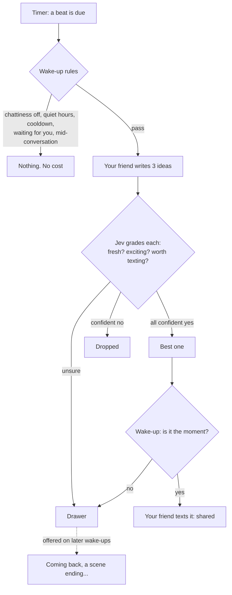

# The heartbeat and the idea drawer

The heartbeat lets your friend reach out out of nowhere, even with the app closed, the way a friend texts "wait, I just had an idea". It's an endgame feature from [DESIGN.md](../DESIGN.md). It builds on [stage 8's wake-ups](stage-8.md) and [Jev](jev-audit.md), and borrows Kitsikai's notifications.

## Using it

- **Settings → Your friend reaching out → Heartbeat**: off by default, or about every 2, 4, 6, 8 or 12 hours, or once a day. Each gap varies by ±20%, so it never feels like clockwork.
- **Set quiet hours** in the same section, so it never wakes you at night.
- **Idea drawer** (same section): every idea your friend had, marked shared, saved or dropped, with how much Jev liked it. **Forget** removes one. **Beat now** runs a heartbeat straight away, to try it.
- **On your phone** (Termux), install Termux:API for notifications (see the README). When your friend writes on their own and the app isn't on screen, you get a notification, "Arlo in #ooc", and tapping it opens that channel.

## How a beat works

`src/heartbeat.ts`:

1. **The rules first** (`Wakeups.blocked`), exactly as for any wake-up: chattiness (off stops the heartbeat), quiet hours, the cooldown, never twice unanswered, and not within 30 minutes of the last message. Most beats stop here, before spending anything.
2. **Generate.** The profile that writes OOC is asked, as your friend, for three ideas: a new story (`story`), a character, a twist for a story you're in, or a thought about something you talked about. It sees the server's digests, your latest OOC chat, the notebook's names, and the ideas it's had before, so it doesn't repeat itself.
3. **Grade.** Jev asks three questions about each idea, as a series that must all agree:
   - Is it **fresh**, not something the stories already did or you already talked about? This is Kitsikai's redundancy check.
   - Would you likely be **excited** by it?
   - Is it **worth texting** about, rather than generic?

   All confident yeses: exciting. All confident noes: dropped. Anything else goes in the drawer.
4. **Share the best.** The exciting idea with the highest grade becomes a **heartbeat wake-up**, with the idea in the prompt ("You had an idea you're excited to share: ..."). Jev's usual "is it the moment?" still comes first. If your friend writes, the idea is **shared**; if not, it goes in the drawer.
5. **Just because.** With no exciting idea, if you haven't written for at least `heartbeatHours`, your friend may still check in, with the best of the drawer to bring up if it fits. Jev still decides whether it's the moment.

Without Jev, ideas aren't graded, so nothing counts as exciting, and they go in the drawer.

## The idea drawer

`src/ideas.ts` keeps every idea with its kind, grade, status and a note on why:

| Status | Means |
| --- | --- |
| **shared** | Your friend brought it up with you |
| **saved** (`drawer`) | Good, or maybe good, but not shared yet |
| **dropped** | Jev was confident it wasn't worth it. It's kept a while so the same idea isn't had again |

On other wake-ups (you coming back, a scene ending, and so on), the three best saved ideas are offered to your friend ("Ideas you've been saving for the right moment: bring one up only if it fits now"). After they write, Jev is asked which of those the message actually brought up, each in two phrasings, like Kitsikai's "did her text remind them?". Those are marked shared; unsure ones stay saved. At most 120 ideas are kept, and dropped and shared ones go first.

## Notifications

`src/notify.ts`, borrowed from Kitsikai:

- When a wake-up or heartbeat writes to you and the app isn't on screen, the server runs Termux:API's `termux-notification`. It's titled "Arlo in #ooc", with the message as the text, and tapping it opens the app at that channel. There's one notification per channel, and a newer one replaces the older.
- **On screen?** The app tells the server (`POST /api/presence`) when it's shown or hidden, and every 15 seconds while it's shown. No word for a minute counts as not on screen.
- **Staying awake**: with the heartbeat on, the server runs `termux-wake-lock`, so Android doesn't pause it.
- On a computer (no Termux), notifications are quietly off, and Settings says so.

## Where it's stored

Migration 12 in `src/db.ts`:

| Table | Holds |
| --- | --- |
| `ideas` | The idea drawer |
| `app_state` | Small values kept between runs: when the next heartbeat is |

## Settings

| Setting | Default | What it does |
| --- | --- | --- |
| `heartbeatHours` | 0 (off) | About how often the heartbeat beats, in hours (1 to 168). Changing it starts the count again |

The heartbeat also follows the wake-up settings: chattiness, quiet hours, the cooldown.

## API

- `POST /api/presence` with `visible`: the app is (or isn't) on screen.
- `POST /api/heartbeat`: beat now, and wait for it. Returns what happened (`beat`) and the ideas.
- `GET /api/ideas`, `DELETE /api/ideas/:id`: the idea drawer.
- `GET /api/state` also has `notifications` (whether they work here) and `heartbeatNext`.

## Tests

`test/heartbeat.test.ts`:

- reading ideas and the grading questions;
- presence timing out;
- off and not-yet-due beats, with the first check only scheduling;
- the rules stopping a beat before any cost;
- the best exciting idea shared, the rest saved or dropped, with a notification;
- not the moment (drawer);
- no notification while the app is on screen;
- nothing exciting (drawer), and a just-because check-in that brings up a drawer idea and marks it shared;
- drawer ideas offered on other wake-ups;
- the API.

The settings and the idea drawer were checked in a real browser on a phone-sized screen.
