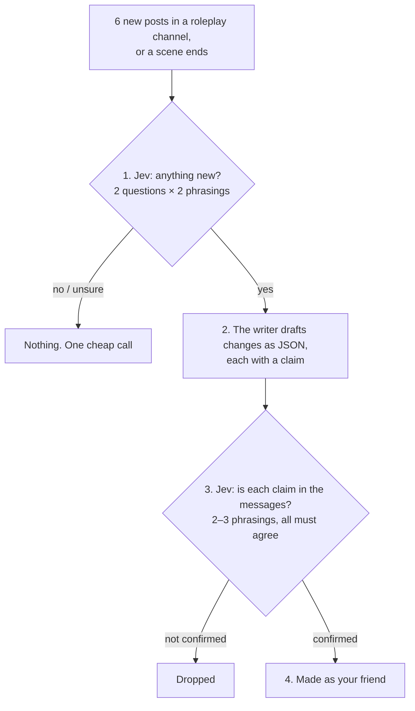

# The notebook keeper

The notebook keeper notices what the story establishes and writes it into the notebook, so neither of you has to stop and do it. It handles new characters, places and things, and lasting facts about the ones you already have: a character gets a name, a place turns out to be haunted, Ilse admits she had a brother. It works between turns, as your friend, and what it did shows in the channel like any of their actions:

> ⚙ Arlo added Tamsin to the notebook, noted in Ilse Marrow: Background

Turn it on or off, and choose how often it looks, in **Settings → Decisions (Jev) → Notebook keeper** (on by default, every 6 posts).

## Checked at every step

A keeper that writes down wrong things is worse than none. So it's built around **Jev** (the decision model, see [stage 8](stage-8.md)), and unsure always means "leave the notebook alone" (`src/keeper.ts`):

1. **Is there anything?** Jev reads the new posts and the notebook (with the notes of entries the posts mention), and is asked three things, **each in two phrasings**: is someone or something new named that will matter again? Is there a lasting fact about something already in the notebook that its notes don't say? Does the story **contradict** something the notes say (an idea from Kitsikai's "does this take back the note?")? A question counts as yes only when **both** phrasings are confident yeses. Most of the time the answer is no, and that's all it costs.
2. **What exactly?** On a yes, a writer model (the profile or roulette that writes summaries) drafts up to 4 changes as JSON. Each is a new entry (character or lore), notes to add to an existing entry, or a **correction** (a field rewritten because the story changed it). Each comes with a one-sentence **claim** of what the story established. The writer sees the notes of entries the new posts mention, and only the names of the rest.
3. **Is it really in the text?** Jev checks every claim against **the messages alone**: "According to the story messages, is this true: ...?" and "Is this stated or clearly shown, rather than guessed or invented?", plus, for a new entry, whether it's likely to matter again. Every phrasing must be a confident yes, or the change is dropped.
4. **Made as your friend:**
   - New entries are **shared** (joint), since either of you might have introduced them. They start from the kind's template, with the drafted notes filled in.
   - Notes for an existing entry go into its fields: an empty field is filled, a field that doesn't already say it gets the note added, and a new label becomes a new field.
   - A correction rewrites the fields it names ("⚙ Arlo corrected Ilse Marrow: Age").
   - The notebook's permissions apply as for any of your friend's edits: their entries and shared ones change directly, and locked entries are left alone. **Your own entries only ever get suggestions** from the keeper (in the inbox), even the ones open to your friend: nothing of yours changes unless you say so.

Every Jev call is in the **Jev log** (purposes "Notebook keeper" and "Notebook keeper (check)"). The changes are in the channel's **tool log** as `notebook_keeper`, with the draft, the result and Jev's check.

## A series: asking one thing several ways

Steps 1 and 3 use a Jev **series** (`askSeries` in `src/jev.ts`): the same yes/no question in two or three wordings, sent together in one request. The verdict is **yes** only if every wording is a confident yes, **no** only if every one is a confident no, and **unsure** otherwise. A question can be misread through one wording that another avoids, so requiring agreement trades a little recall for far fewer mistakes. It costs nothing extra, since it's still one call.

## What it reads, and what it doesn't

- **Only roleplay channels.** In OOC you're talking *about* the story, and ideas there aren't canon yet.
- **Each post once.** It remembers how far it has read in each channel (`keeper_state`), and reads at most the newest 24 unread posts at a time. Editing an old post doesn't set it off again.
- **Nothing hidden from you.** Like summaries, it works from the messages, which you can read, and only shows the writer entries that aren't hidden from you. Claims are checked against the messages alone, so nothing from a secret entry can end up in a shared one.
- It waits 8 seconds after a change (so a turn's several messages count once), and does nothing without an API key, or with Jev turned off and no fallback profile.

## Where it's stored

Migration 10 in `src/db.ts` adds `keeper_state` (how far the keeper has read in each channel), and rebuilds `tool_calls` so its `source` can be `keeper`. SQLite can't change a CHECK constraint in place; every call is kept, in order.

## Settings

| Setting | Default | What it does |
| --- | --- | --- |
| `notebookKeeper` | on | Whether the keeper runs |
| `keeperEvery` | 6 | How many new posts before it looks (a scene ending always counts) |

It uses Jev's settings (`decisionModel`, `decisionConfidence`, `decisionFallback`), and `summaryAssignment` for the writer.

## Tests

`test/keeper.test.ts`:

- Jev series: agreement, verdicts, missing answers;
- reading drafts forgivingly, and merging notes into fields;
- waiting for enough posts, and a scene ending counting;
- the usual "nothing", as one call, with the posts marked read;
- disagreeing phrasings meaning unsure;
- a new character end to end (checked three ways, shared, logged as your friend's action);
- unconfirmed claims dropped;
- notes changing your friend's entry directly and becoming a suggestion on one of yours;
- hidden entries never reaching the writer;
- OOC and the off switches;
- failures read again next time;
- settings.

`test/store.test.ts` checks that migration 10 keeps the tool log in order.

The activity line and the settings were checked in a real browser against a fake model and a fake Jev.
