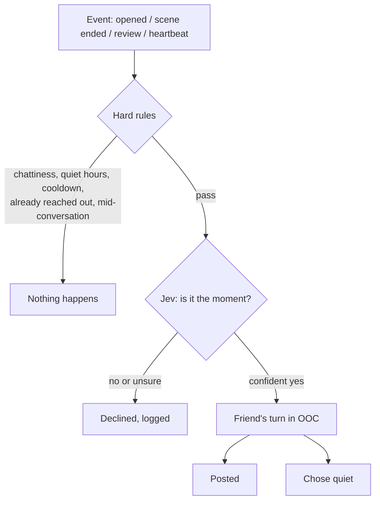

# Stage 8: how your friend reaches out

Stage 8 is where the design's core rule pays off: *a friend turn never requires a message from you*. According to [DESIGN.md](../DESIGN.md), its new concept is **events**: something happens, and your friend may take a turn because of it.

## What you can do now

- **Come back to a message.** Open the app after a while away, and your friend may have written to you in OOC ("Welcome back! I kept thinking about the lighthouse..."). A dot in the channel list marks channels with messages you haven't seen.
- **Hear what they thought of a scene.** When you end a scene, once it's summarized, your friend may say something about how it went, out of character.
- **Get your suggestions reviewed promptly.** A suggestion for one of your friend's entries wakes them to review it.
- **Choose how chatty they are** in Settings → Your friend reaching out: off, quiet, normal or chatty; how long counts as "away"; how often they may reach out at most; and quiet hours. **Recent wake-ups** lists what could have woken them and what came of it.
- **See Jev's decisions** in Settings → Decisions (Jev): its model, how sure it has to be, a fallback profile, a **Test Jev** button, and the **Jev log**.
- Kinaera now runs on **port 4747** by default, so it doesn't clash with Kitsikai (on 3000).

## Concept: events

Until now, every turn started with you: a message, a comment, or the Friend's turn button. An **event** is something that happens without anyone asking for a turn, and a small piece of code (`Wakeups.event` in `src/wakeups.ts`) decides whether it should become one.



The events:

| Event | When | Reason in the log |
| --- | --- | --- |
| You open the app | On start, and on coming back after 5 minutes away from the tab | "away" if you haven't written for `awayHours`, otherwise "opened" |
| A scene ends | A scene *you* ended, once its summary is written (straight away with summaries off), and only if it's the newest scene and ended within the last hour | "scene-ended" |
| A suggestion for your friend | You edit (or delete) an entry they own, and it becomes a suggestion for them | "review" |
| The heartbeat | Endgame (see DESIGN.md) | "heartbeat" |

### The hard rules

These are plain code, checked first, so most events cost nothing:

- **Chattiness** (`wakeups`): which reasons count. Off: none. Quiet: away and reviews. Normal (the default): also a scene ending. Chatty: also just opening the app.
- **Quiet hours** (`quietStart` to `quietEnd`, wrapping past midnight): no wake-ups, except reviews (which are silent work).
- **A cooldown** (`wakeCooldownMinutes`, default 60) since your friend last took a wake-up turn; reviews have their own 10 minutes.
- **Never twice in a row**: once they've written to you on a wake-up, they wait for you to write before reaching out again (reviews aside).
- **Not mid-conversation**: "opened" doesn't count within 30 minutes of the last message.
- Not while they're already writing in that channel, and not without an API key. A review needs a tool-capable profile for OOC.

Events that don't pass aren't logged: they're not decisions, just rules.

### Jev: is it the moment?

Next comes the one real judgement: would a message feel natural and welcome right now, or like too much? That's asked of **Jev**, TypeSafe's decision model on nanoGPT (`typesafe/jev-1.13`), the same way [Kitsikai](https://github.com/626andup-cmyk/kitsikai.) does. Jev doesn't write; it answers questions with probabilities, quickly and cheaply.

Jev is shown a snapshot (`snapshot` in `src/wakeups.ts`):

```
It's Tuesday 7:42 PM.
The user last wrote 6 hours ago.
Their latest out-of-character chat (#ooc), newest last:
User: gotta go, talk later!
Waiting:
Your proposal to delete #old-ideas is waiting for the user.
```

and one question, depending on the reason (for "away": "The user just came back to the app after 6 hours away. Would a short, friendly message from their writing friend feel natural and welcome right now?").

Answers are read in three tiers (`tier` in `src/jev.ts`): **yes** only when Jev's probability for yes is at least `decisionConfidence` (default 0.8), **no** when no is, and otherwise **unsure**. Unsure takes the safe path, so only a confident yes wakes your friend. If Jev fails, a **fallback profile** (`decisionFallback`) is asked the same question; if that fails too, the wake-up is logged as failed. With no decision model and no fallback, the turn itself decides (below).

Reviews skip Jev: they're work, not conversation.

### The turn

A wake-up is an ordinary friend turn (`friend.takeTurn(channelId, "wake", { wake })`) in your **home OOC channel**, the one you talked in last. Its prompt gains a section after the tools, **Why you're up** (`describeWake` in `src/prompt.ts`):

```
You're taking a turn on your own: the user hasn't sent you anything new. The user
just opened the app after being away for 6 hours. It's been 6 hours since the user
last wrote anything.

Waiting:
- The user's suggested change to Ilse is waiting for your review.

Reach out only if you genuinely want to: a thought, a question, a reaction, an idea
for a story. Keep it short and natural, like a text from a friend... If there's nothing
worth saying, don't write: call do_nothing (you can still act with your tools first).
```

A scene ending adds the scene's title and summary. The conversation then ends with a note in place of a message from you (`wakeNudge`), so the model knows nobody just spoke.

Your friend can write, act with tools (reviewing the suggestion, for example), or do nothing: `do_nothing` with tools, or replying exactly `[nothing]` without (`isNothing`), which is never saved as a message. The outcome is logged as **posted** (they wrote) or **quiet** (they didn't, whether or not they acted).

## Noticing new messages

A wake-up posts while you're not looking, so the app now checks for news. `GET /api/state` includes a **revision**, a number that goes up whenever any message changes, and each channel's **activity** (its newest message: id, author, time). While the app is visible it checks every 15 seconds; when the revision moved, it reloads the channel list and the open channel. A dot marks channels whose newest message is your friend's and newer than what you last saw (remembered in the browser, `kinaera.seen`).

## Where things are stored

Migration 8 in `src/db.ts` adds two tables:

| Table | Holds |
| --- | --- |
| `wakeups` | The wake-up log: when, why, what came of it (`posted`, `quiet`, `declined` or `failed`), the channel, and a sentence of detail. The newest 300 are kept |
| `jev_log` | Every Jev call: its purpose, model, the request and reply exactly as sent and received, any error, who answered (Jev or the fallback) and what, and how long it took. Calls older than 36 hours are pruned |

## Settings

| Setting | Default | What it does |
| --- | --- | --- |
| `wakeups` (Chattiness) | normal | Which events can wake your friend: off, quiet, normal, chatty |
| `awayHours` | 4 | How long without writing counts as being away |
| `wakeCooldownMinutes` | 60 | The least time between wake-ups |
| `quietStart`, `quietEnd` | -1 (none), 8 | Quiet hours, as hours of the day |
| `decisionModel` | `typesafe/jev-1.13` | Jev's model. Empty turns Jev off |
| `decisionConfidence` | 0.8 | How sure Jev has to be for a yes (or a no) to count |
| `decisionFallback` | "" (nobody) | A profile to ask when Jev can't answer |

In `.env`, `PORT` now defaults to **4747**.

## API

- `POST /api/wake` with `{"event": "opened"}`: you opened the app. Answers straight away; a wake-up, if any, happens in the background and shows up through the revision.
- `GET /api/wakeups`: the newest wake-ups.
- `POST /api/jev/test`: ask Jev one tiny question with an obvious answer, and explain what came back.
- `GET /api/jev/log` (`?errors=1` for failures only): every Jev call from the last 36 hours.
- `GET /api/state` now includes `revision` and `activity`.

## Tests

- **`test/wakeups.test.ts`** (new): durations and quiet hours; the home channel; `[nothing]`; coming back (Jev yes, no, unsure, failing, turned off; `do_nothing`); "opened" only when chatty and not mid-conversation; chattiness off, quiet hours, the cooldown and never reaching out twice; no API key; a scene ending with its summary; reviews skipping Jev and quiet hours; the wake prompt; and the API (wake, the logs, Test Jev, the revision, settings checks).

The app (a wake-up arriving and its unread dot, the new settings, the wake-up log, Test Jev and the Jev log) was checked in a real browser against a scripted fake model and a fake Jev, on a phone-sized screen.

## What's next

The endgame features in DESIGN.md: the heartbeat (with generate-and-grade and the idea drawer), the notebook keeper, emoji reactions, channel categories, multi-bubble OOC, RNG friend creation, a reference library, and more of the app's guesswork going through Jev.
